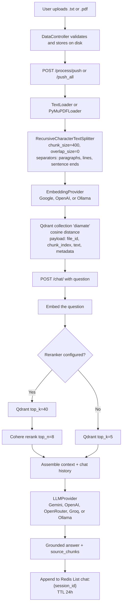

<div align="center">

# DiaMate-RAG

<div align="center">
  
  
  
  
  
  
</div>

**Grounded retrieval-augmented generation for diabetes health information**

A production-shaped FastAPI service that ingests clinical-style documents, stores their embeddings in Qdrant, and answers medical questions in English, Egyptian Arabic, and Modern Standard Arabic using only the retrieved context — never a free-form hallucination.

</div>

---

## Table of Contents
- [Features](#features)
- [Quick Start](#quick-start)
- [Philosophy](#philosophy)
- [Installation](#installation)
- [API Endpoints](#api-endpoints)
- [Project Structure](#project-structure)
- [Architecture](#architecture)
- [Configuration Reference](#configuration-reference)
- [Evaluation](#evaluation)
- [Development & Debugging](#development--debugging)
- [License](#license)

## Features

- **Multi-format ingestion** — Upload plain text (`.txt`) and PDF files. PDFs are parsed with `PyMuPDFLoader`; text files with `TextLoader`.
- **Pluggable providers** — Mix and match embeddings, LLM, and rerankers across Google Gemini, OpenAI, OpenRouter, Groq, Ollama (local), and Cohere. Swap by editing `src/.env`, no code changes.
- **Vector storage with cosine similarity** — Qdrant collection stores `file_id`, `chunk_index`, `text`, and document metadata alongside each vector.
- **Recursive chunking** — `RecursiveCharacterTextSplitter` with `["\n\n", "\n", ".", "?", "!", " ", ""]` separators. Defaults: `chunk_size=400`, `overlap_size=0`. Both are tunable per request.
- **Optional reranking** — When `RERANKING_PROVIDER=cohere` is set, the pipeline retrieves the top 40 candidates and reranks down to the top 8 with `rerank-v4.0-pro` for cleaner answers.
- **Strict grounding** — A locked system prompt instructs the LLM to answer only from the retrieved context, mirror the question's language, and surface exact numerical values from the source.
- **Multilingual out of the box** — Native support for English, Egyptian Arabic (عامية), and Modern Standard Arabic (فصحى).
- **Conversation memory** — Redis Lists under the key `chat:{session_id}` with a 24-hour TTL keep per-session history. The service degrades gracefully if Redis is unreachable.
- **Embedding-mismatch safety lock** — The active embedding model is stored in Qdrant collection metadata. On startup, the app detects drift between the configured model and the stored model and returns `409 EMBEDDING_MODEL_MISMATCH` from push and chat until you call `/api/v1/process/reindex`.
- **RAGAS-ready evaluation** — `eval/populate_rag_dataset.py` harvests answers and contexts from a running API into a CSV; `eval/ragas_eval.py` runs Faithfulness, Answer Relevancy, Context Precision, and Context Recall with Groq as judge and Ollama as embedder.

## Quick Start

### 1. Clone and configure

```bash
git clone https://github.com/MohamedHamed05/DiaMate-RAG.git
cd DiaMate-RAG
cp src/.env.example src/.env
# edit src/.env with at least one provider key
```

### 2. Bring up the full stack with Docker

```bash
cd docker
docker compose up -d --build
```

This starts the API on `localhost:8000`, Qdrant on `localhost:6333`, and Redis on `localhost:6379`.

### 3. Verify health

```bash
curl http://localhost:8000/api/v1/
```

### 4. End-to-end usage

```bash
# Upload a document
curl -X POST http://localhost:8000/api/v1/data/upload \
  -F "file=@diabetes_info.pdf"

# Embed it (use the File_ID returned above)
curl -X POST http://localhost:8000/api/v1/process/push \
  -H "Content-Type: application/json" \
  -d '{"file_id": "YOUR_FILE_ID", "chunk_size": 400, "overlap_size": 0}'

# Ask a question
curl -X POST http://localhost:8000/api/v1/chat/ \
  -H "Content-Type: application/json" \
  -d '{"session_id": "user-123", "question": "What are the symptoms of type 2 diabetes?"}'

# Check embedding status
curl http://localhost:8000/api/v1/process/status
```

Interactive docs: Swagger UI at `http://localhost:8000/docs`, ReDoc at `http://localhost:8000/redoc`.

## Philosophy

DiaMate-RAG is part of the DiaMate project at Benha Faculty of Computers and Artificial Intelligence (BFCAI), Benha University. The system is built around three convictions:

**Healthcare AI has to be honest about its sources.** When a model answers a medical question from memory, even a well-aligned one, it can invent studies, dosages, and risk numbers. The system is designed to refuse to answer beyond its retrieved context. The LLM is told, in a system prompt, to use only the supplied passages, to surface exact figures, and to say it does not know when the context is silent. This trades recall for trustworthiness — a worthwhile trade in a clinical setting.

**Grounding should be a pipeline, not a wrapper.** The service treats retrieval, reranking, prompt assembly, and generation as explicit stages, each with its own provider. Switching embedding model, LLM, or reranker is a `.env` change. This makes it easy to evaluate quality trade-offs, fall back to a local Ollama stack for privacy-sensitive deployments, and reason about cost.

**Retrieval needs a safety net.** A common failure mode is silent semantic drift: a new embedding model produces vectors that look fine but no longer match the stored index. The startup-time comparison of the configured embedding model against the stored collection metadata surfaces this immediately, and the runtime check returns `409 EMBEDDING_MODEL_MISMATCH` from push and chat endpoints until you call `/api/v1/process/reindex`. There is no path that lets a fresh collection answer questions with stale vectors.

## Installation

### Requirements

- Python 3.11+
- Docker and Docker Compose (recommended for the full stack)
- An API key for at least one provider — Google, OpenAI, OpenRouter, Groq, Cohere — or a running Ollama instance

The shipped `src/.env.example` pre-selects Ollama for embeddings, Google for the LLM, and Cohere for reranking. Change these to match the providers you have keys for.

### Option A — Docker (recommended)

```bash
git clone https://github.com/MohamedHamed05/DiaMate-RAG.git
cd DiaMate-RAG
cp src/.env.example src/.env
# set provider keys in src/.env; docker-compose already overrides the infra hosts
cd docker
docker compose up -d --build
```

The compose file ships Qdrant `v1.17.0`, Redis `7-alpine`, and the API service, and it already overrides `QDRANT_HOST`, `REDIS_HOST`, and `OLLAMA_HOST` to the container network names. Uploads persist on a bind-mounted `src/assets/files`. Health check: `curl http://localhost:8000/api/v1/`.

To stop:

```bash
cd docker
docker compose down
```

### Option B — Local development

```bash
git clone https://github.com/MohamedHamed05/DiaMate-RAG.git
cd DiaMate-RAG

# Create and activate a virtual environment
python -m venv .venv
# Windows
.venv\Scripts\activate
# macOS / Linux
source .venv/bin/activate

# Install dependencies
pip install -r src/requirements.txt

# Start Qdrant and Redis however you prefer, then run the API
cd src
uvicorn main:app --host 0.0.0.0 --port 8000 --reload
```

Note: local development expects Qdrant and Redis to be reachable at the hosts configured in `src/.env` (defaults: `localhost:6333` and `localhost:6379`). When using Docker Compose, these hosts are overridden automatically to `qdrant` and `redis`.

## API Endpoints

All endpoints live under the `/api/v1` prefix. The interactive OpenAPI specification is available at `/docs` and `/redoc`.

### `GET /api/v1/` — Health

Returns the configured app name, version, and a static status string.

**Response (200):**
```json
{
  "App Name": "DiaMate-RAG",
  "App Version": "1.0",
  "Status": "Good"
}
```

### `POST /api/v1/data/upload` — Upload a document

Multipart form-data, single field `file`. Accepts `text/plain` and `application/pdf` only, up to 50 MB.

**Response (200):**
```json
{
  "Signal": "File Uploaded Successfully",
  "File_ID": "<uuid>_<filename>"
}
```

### `GET /api/v1/data/files` — List uploaded files

**Response (200):**
```json
{
  "Signal": "File Processed Successfully",
  "files": ["<uuid>_file1.pdf", "<uuid>_file2.txt"]
}
```

### `DELETE /api/v1/data/{file_id}` — Delete a file and its chunks

Removes the file from disk and deletes every Qdrant point whose payload has `file_id == {file_id}`.

**Response (200):**
```json
{ "Signal": "File Deleted Successfully" }
```

**Response (404):**
```json
{ "Signal": "File Failed to Delete" }
```

### `GET /api/v1/process/status` — Embedding status

Reports the total, embedded, and pending file counts, the list of pending IDs, and the model-mismatch flag.

**Response (200):**
```json
{
  "Signal": "File Processed Successfully",
  "total_files": 12,
  "embedded_files": 9,
  "pending_files": 3,
  "pending_file_ids": ["<uuid>_new.pdf"],
  "model_mismatch": false
}
```

### `POST /api/v1/process/push` — Embed a single file

**Request body:**
```json
{
  "file_id": "<uuid>_diabetes_info.pdf",
  "chunk_size": 400,
  "overlap_size": 0
}
```

**Response (200):**
```json
{
  "Signal": "Embeddings Pushed Successfully",
  "inserted_count": 47,
  "message": ""
}
```

If the file is already embedded, returns `inserted_count: 0` and the message `File already embedded, skipped.`. Returns `400 FILE_NOT_FOUND` for an unknown ID, and `409 EMBEDDING_MODEL_MISMATCH` when the active embedding model differs from the stored one.

### `POST /api/v1/process/push_all` — Embed all new files

**Request body:**
```json
{
  "chunk_size": 400,
  "overlap_size": 0
}
```

**Response (200):**
```json
{
  "Signal": "Embeddings Pushed Successfully",
  "new_files_processed": 3,
  "inserted_count": 128
}
```

### `POST /api/v1/process/reindex` — Reindex everything

Drops the Qdrant collection, recreates it with the current embedding model metadata, and re-embeds every uploaded file.

**Request body (same shape as `push_all`):**
```json
{ "chunk_size": 400, "overlap_size": 0 }
```

**Response (200):**
```json
{
  "Signal": "Reindex Completed Successfully",
  "files_processed": 12,
  "inserted_count": 540
}
```

Calling `/process/reindex` clears the `model_mismatch` flag and unblocks push and chat.

### `POST /api/v1/chat/` — Ask a question

**Request body:**
```json
{
  "session_id": "user-123",
  "question": "What are the symptoms of type 2 diabetes?"
}
```

**Response (200):**
```json
{
  "Signal": "Chat Response Generated Successfully",
  "answer": "Common symptoms include ...",
  "source_chunks": [
    {
      "text": "Type 2 diabetes often presents with ...",
      "file_id": "<uuid>_diabetes_info.pdf",
      "score": 0.87,
      "metadata": { "page": 3 }
    }
  ]
}
```

`source_chunks` carries the text, originating file, similarity score, and the original document metadata. Returns `409 EMBEDDING_MODEL_MISMATCH` while the collection is stale.

### `GET /api/v1/chat/sessions` — List active sessions

**Response (200):**
```json
{
  "Signal": "Chat Response Generated Successfully",
  "sessions": ["user-123", "user-456"]
}
```

### `GET /api/v1/chat/{session_id}` — Get conversation history

**Response (200):**
```json
{
  "Signal": "Chat Response Generated Successfully",
  "session_id": "user-123",
  "messages": [
    { "role": "user", "content": "..." },
    { "role": "assistant", "content": "..." }
  ]
}
```

### `DELETE /api/v1/chat/{session_id}` — Clear a session

**Response (200):**
```json
{ "Signal": "Session Cleared Successfully" }
```

### Error & status signals

The `Signal` field on every response is one of the `ResponseSignal` enum values:

| Signal | Meaning |
|---|---|
| `FILE_UPLOAD_SUCCESS` / `FILE_UPLOAD_FAILED` | Upload completed or failed at I/O |
| `FILE_VALIDATION_SUCCESS` / `FILE_TYPE_NOT_SUPPORTED` / `FILE_SIZE_EXCEEDED` | File passed MIME and size checks, or which check it failed |
| `FILE_PROCESS_SUCCESS` / `FILE_PROCESS_FAIL` | Listing and lifecycle lookups |
| `FILE_DELETE_SUCCESS` / `FILE_DELETE_FAILED` | Delete from disk succeeded or the file was missing |
| `EMBEDDING_PUSH_SUCCESS` / `EMBEDDING_PUSH_FAIL` | Embedding push completed or raised |
| `EMBEDDING_REINDEX_SUCCESS` | Full reindex completed |
| `EMBEDDING_MODEL_MISMATCH` | Active model differs from stored collection metadata; call `/process/reindex` |
| `CHAT_SUCCESS` / `CHAT_FAIL` | Chat pipeline succeeded or raised |
| `NO_FILES_FOUND` / `FILE_NOT_FOUND` | No uploads present, or a specific `file_id` was unknown |

HTTP status codes: 200 for success, 400 for validation and pipeline failures, 404 for missing files on delete, 409 for embedding model mismatch.

## Project Structure

```
DiaMate-RAG/
├── docker/
│   ├── Dockerfile                      # API image for local development
│   ├── docker-compose.yml              # API + Qdrant + Redis services
│   ├── .dockerignore
│   └── env/
│       ├── api.env.example
│       ├── qdrant.env.example
│       └── redis.env.example
├── eval/
│   ├── populate_rag_dataset.py         # Send CSV questions to the live API
│   ├── ragas_eval.py                   # RAGAS metrics with Groq + Ollama
├── src/
│   ├── main.py                         # FastAPI app, lifespan, CORS
│   ├── .env.example
│   ├── .env                            # Local config (not committed)
│   ├── requirements.txt
│   ├── assets/
│   │   ├── files/                      # Uploaded document storage
│   │   └── DiaMate-RAG.postman_collection.json
│   ├── controllers/
│   │   ├── base_controller.py
│   │   ├── data_controller.py          # File validation, storage, deletion
│   │   ├── process_controller.py       # LangChain loaders + chunking + embedding
│   │   └── chat_controller.py          # Retrieve → rerank → prompt → generate
│   ├── providers/
│   │   ├── base_provider.py            # EmbeddingProvider / LLMProvider / RerankingProvider ABCs
│   │   ├── factory.py                  # ProviderFactory from settings
│   │   ├── google_provider.py          # Gemini embedding + LLM
│   │   ├── openai_provider.py          # OpenAI embedding + LLM
│   │   ├── openrouter_provider.py      # OpenRouter (LLM only; embeddings raise)
│   │   ├── ollama_provider.py          # Ollama embedding + LLM (local)
│   │   ├── cohere_provider.py          # Cohere reranking
│   │   └── groq_provider.py            # Groq LLM
│   ├── stores/
│   │   ├── qdrant_store.py             # Collection lifecycle, cosine search, payload deletes
│   │   └── redis_store.py              # List-based chat history with TTL
│   ├── routes/
│   │   ├── base.py                     # GET /api/v1/
│   │   ├── data.py                     # Upload, list, delete
│   │   ├── process.py                  # Status, push, push_all, reindex
│   │   ├── chat.py                     # Chat, sessions, history, clear
│   │   └── schemes/
│   │       ├── chat_scheme.py
│   │       ├── data_scheme.py
│   │       └── process_scheme.py
│   ├── models/
│   │   └── enums/
│   │       ├── response_enums.py       # ResponseSignal
│   │       └── process_enums.py        # ProcessingEnum (txt / pdf)
│   └── utils/
│       └── config.py                   # Pydantic Settings loaded from .env
├── LICENSE
├── README.md
└── README ex.md
```

## Architecture

### RAG pipeline



### Layered structure

| Layer | Module | Responsibility |
|---|---|---|
| Transport | `src/main.py`, `src/routes/*.py` | FastAPI app, OpenAPI metadata, CORS, lifespan that wires providers and stores |
| Application | `src/controllers/*.py` | File validation, chunking, embedding orchestration, chat orchestration |
| Provider | `src/providers/*.py` | Unified async interface for embeddings, LLMs, and rerankers |
| Persistence | `src/stores/*.py` | Qdrant vector store, Redis chat-memory store |
| Config | `src/utils/config.py` | Pydantic Settings loaded from `src/.env` |

### Embedding-mismatch safety lock

1. On collection creation, the active embedding model is written into the Qdrant collection metadata under the key `embedding_model`.
2. On startup, the app reads the stored model and compares it to the configured `EMBEDDING_MODEL` (or the literal string `"default"` if the override is blank). If they differ, `app.state.embedding_model_mismatch` is set to `true`.
3. While the flag is true, `POST /api/v1/process/push`, `POST /api/v1/process/push_all`, and `POST /api/v1/chat/` return `409` with `Signal: "Embedding model changed. Call /api/v1/process/reindex to re-embed your data."`.
4. `POST /api/v1/process/reindex` drops the collection, recreates it with the active model, and re-embeds every file. On success, the flag is cleared and the API returns to normal operation.

### Redis chat memory

Chat history is stored as a Redis List per session, keyed `chat:{session_id}`. Each `RPUSH` is followed by `EXPIRE` so the TTL refreshes on every message. The default TTL is 86,400 seconds (24 hours). If Redis is unreachable, the store catches the connection error at startup, marks itself disconnected, and silently returns empty history — the API keeps working without session memory.

### Reranking path

When `RERANKING_PROVIDER=cohere`, the chat controller:

1. Pulls the top 40 candidates from Qdrant with the question vector.
2. Sends the candidate texts to Cohere's `rerank-v4.0-pro` with `top_n=8`.
3. Replaces each candidate's similarity score with the reranker relevance score, keeping the original payload (text, file_id, metadata) intact.
4. Assembles the final context from those 8 documents.

This is the path to take when the base retriever returns too much noise and answers start citing irrelevant chunks.

## Configuration Reference

All configuration is read from `src/.env` by Pydantic Settings. The values that are required (`APP_NAME`, `APP_VERSION`, `ALLOWED_FILE_TYPES`, `MAX_FILE_SIZE`, `FILE_DEFAULT_CHUNK_SIZE`) have no defaults and must be set.

| Variable | Default | Description |
|---|---|---|
| `APP_NAME` | required | Display name returned by `/api/v1/` |
| `APP_VERSION` | required | Version string returned by `/api/v1/` |
| `ALLOWED_FILE_TYPES` | required | Accepted MIME types, e.g. `["text/plain", "application/pdf"]` |
| `MAX_FILE_SIZE` | required | Maximum upload size in MB |
| `FILE_DEFAULT_CHUNK_SIZE` | required | Stream-read chunk size in bytes used by the upload endpoint |
| `EMBEDDING_PROVIDER` | `google` | `google`, `openai`, `openrouter`, or `ollama` |
| `LLM_PROVIDER` | `google` | `google`, `openai`, `openrouter`, `ollama`, or `groq` |
| `RERANKING_PROVIDER` | `""` (empty) | `cohere` to enable reranking, empty to disable |
| `GOOGLE_API_KEY` | `""` | Gemini API key |
| `OPENAI_API_KEY` | `""` | OpenAI API key |
| `COHERE_API_KEY` | `""` | Cohere API key |
| `GROQ_API_KEY` | `""` | Groq API key |
| `OPENROUTER_API_KEY` | `""` | OpenRouter API key |
| `OLLAMA_HOST` | `ollama` | Ollama service hostname (used by docker-compose) |
| `OLLAMA_BASE_URL` | `http://ollama:11434` | Full Ollama base URL |
| `OLLAMA_EMBED_BATCH_SIZE` | `32` | Texts per Ollama `/api/embed` request |
| `EMBEDDING_MODEL` | `""` | Override the provider's default embedding model |
| `LLM_MODEL` | `""` | Override the provider's default LLM |
| `RERANKING_MODEL` | `""` | Override the default reranking model |
| `QDRANT_HOST` | `localhost` | Qdrant hostname |
| `QDRANT_PORT` | `6333` | Qdrant port |
| `QDRANT_COLLECTION` | `diamate` | Qdrant collection name |
| `REDIS_HOST` | `localhost` | Redis hostname |
| `REDIS_PORT` | `6379` | Redis port |
| `REDIS_DB` | `0` | Redis logical database |
| `REDIS_CHAT_TTL` | `86400` | Chat session TTL in seconds (24 hours) |
| `CORS_ORIGINS` | `["*"]` | Allowed origins for the FastAPI CORS middleware |

### Provider default models

These are the models selected when the corresponding `*_MODEL` override is left blank.

| Provider | Embedding default | LLM default | Reranking default | Notes |
|---|---|---|---|---|
| Google | `gemini-embedding-001` | `gemini-2.5-flash` | — | Embedding + LLM |
| OpenAI | `text-embedding-3-small` | `gpt-5-mini-2025-08-07` | — | Embedding + LLM |
| OpenRouter | — | `openai/gpt-oss-120b` | — | LLM only; embeddings raise `NotImplementedError`. Pair with a different `EMBEDDING_PROVIDER`. |
| Ollama | `bge-m3:latest` | `qwen3.5:9b` | — | Local; pull the models into your Ollama instance first |
| Groq | — | `llama-3.3-70b-versatile` | — | LLM only; used by the chat path and by `ragas_eval.py` |
| Cohere | — | — | `rerank-v4.0-pro` | Reranking only; set `RERANKING_PROVIDER=cohere` to enable |

## Evaluation

The `eval/` directory ships two scripts that work together to give you a measurable view of retrieval quality.

### Populate a QA dataset

`eval/populate_rag_dataset.py` reads a CSV of questions (and ground-truth answers) and calls the live API for each row, appending the model's `answer`, the retrieved `contexts`, and a `status` flag. The script is resume-safe: rows that already have `status == "ok"` are skipped, so re-running the script only fills in the gaps.

```bash
python eval/populate_rag_dataset.py path/to/qa_dataset.csv
```

### Run RAGAS metrics

`eval/ragas_eval.py` consumes the populated CSV and computes four metrics using Groq as the judge LLM and Ollama's `embeddinggemma:latest` as the embedder:

- **Faithfulness** — Is the answer grounded in the retrieved context?
- **Answer Relevancy** — Does the answer address the question?
- **Context Precision** — Are the retrieved chunks ranked in the right order?
- **Context Recall** — Did retrieval surface the information needed to answer?

```bash
# Add GROQ_API_KEY to src/.env, then:
python eval/ragas_eval.py eval/english_qa_dataset_done.csv
```

Per-row scores are written back into the input CSV under matching column names, and a mean / min / max summary is printed to the console.

## Development & Debugging

### Local development workflow

```bash
pip install -r src/requirements.txt
cd src
uvicorn main:app --host 0.0.0.0 --port 8000 --reload
```

The `--reload` flag watches `src/` and restarts on save. Stop with `Ctrl+C`.

### Useful endpoints

- **Swagger UI** — http://localhost:8000/docs
- **ReDoc** — http://localhost:8000/redoc
- **Qdrant dashboard** — http://localhost:6333/dashboard (when using docker-compose)
- **Health check** — `GET /api/v1/`

### Postman collection

A Postman collection covering all endpoints ships at `src/assets/DiaMate-RAG.postman_collection.json`. Import it into Postman, point the base URL at your local API, and you have a clickable reference for every request and response shape.

### Common issues

- **Embedding model mismatch** — The API returns `409 EMBEDDING_MODEL_MISMATCH` from push and chat. Run `POST /api/v1/process/reindex` to wipe and rebuild the collection under the active model.
- **OpenAI model id errors** — `gpt-5-mini-2025-08-07` is the configured default. If you switch to a model your account cannot access, set `LLM_MODEL` to one your key can reach.
- **OpenRouter embeddings** — OpenRouter does not provide embeddings, and the provider raises `NotImplementedError` if you try to use it for `EMBEDDING_PROVIDER`. Pair OpenRouter for the LLM with Google, OpenAI, or Ollama for embeddings.
- **Redis down** — The API logs `Redis is not available. Chat memory will be disabled.` and keeps serving requests with empty chat history. Bring Redis back up and session memory resumes on the next call.
- **No files in the vector store** — `POST /api/v1/chat/` still returns an answer, but the system prompt is told the context is empty. Either upload and embed documents first, or check `GET /api/v1/process/status` for the pending list.
- **Stale `.env`** — The most common cause of "the API is calling the wrong model" is an unset `*_MODEL` variable paired with a provider change. Clear the override and restart, or set it explicitly.

## License

Apache License 2.0 — Copyright (c) 2026 Mohamed Hamed. See [LICENSE](LICENSE) for full text.